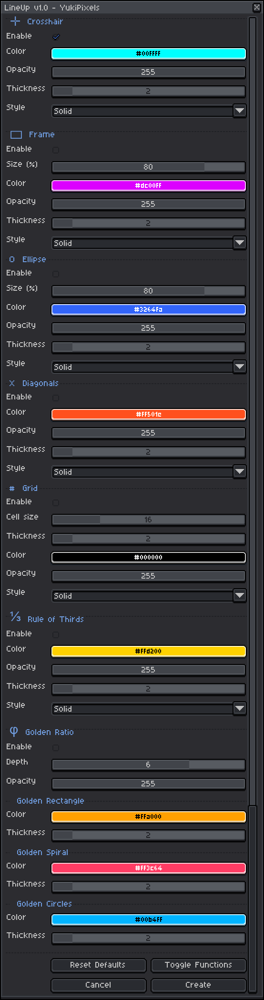

# 📐 Layouts a Drawing Layouts Tool Script

**Layouts** is a script made for [Aseprite](https://www.aseprite.org/) that draws guides directly onto your canvas as individual and non destructive layers.

---

## 🛠️ Features

* **7 Drawing Functions:** Crosshair, Frame, Ellipse, Diagonals, Grid, Rule of Thirds, and Golden Ratio.
* **Fully Customizable:** Every function has its own settings for color, opacity, thickness or line style.
* **Non Destructive:** Functions are drawn on their own named layers, keeping your work untouched.
* **Reset Defaults:** Button to restore all settings to their default values with a single click.
* **Toggle Functions:** Button to show or hide all Layouts layers without having to delete them.
* **Persistent Settings:** Your last configuration is automatically saved and reloaded on next launch.

## 🖼️ Preview

## 🗂️ Function Types

| Functions | Description |
|---|---|
| ✛. **Crosshair** | Draw a centered horizontal and vertical lines with customizable color, thickness and style |
| ▭. **Frame** | Draw a proportional inner frame with customizable size, color, thickness and style |
| O. **Ellipse** | Draw a centered ellipse with customizable size, color, thickness and style |
| X. **Diagonals** | Draw a corner to corner diagonal lines with customizable color, thickness and style |
| #. **Grid** | Draw a regular grid with adjustable size customizable size, color, thickness and style |
| ⅓. **Rule of Thirds** | Draw the classic 3×3 composition grid with customizable color, thickness and style |
| φ. **Golden Ratio** | Draw the Golden Ratio Rectangle, Spiral and Circle with customizable color and thickness |

## 💾 Installation

1. Download `Layouts.lua`
2. In Aseprite, go to **File → Scripts → Open Scripts Folder**
3. Put `Layouts.lua` into that folder
4. Back in Aseprite, go to **File → Scripts → Rescan Scripts Folder**
5. Run it via **File → Scripts → Layouts**

> 🔐 **First Launch Security:** Aseprite will show a security alert the first time you run the script. In that dialog:
> - Check **"Don't show this specific alert again for this script"**
> - Check **"Give full trust to this script"**
> - Click **"Allow read access"**
>
> This is required for Layouts to save and reload your settings between sessions.

> ⚠️ **Enable/Disable function:** Each functions have an **Enable** checkbox at the top of their section, they are not all enabled by default!

## 📃 License

Layouts is released under the **MIT License** — free for personal and commercial use, no attribution required.

## 🔗 Support and Links

* **Download:** [Latest Release](https://github.com/yukipixels/Layouts/releases/latest)
* **Itch.io:** [yukipixels.itch.io](https://yukipixels.itch.io)
* **Socials:** [linktr.ee/yukipixels](https://linktr.ee/yukipixels)
* **Contact:** yukipixels@gmail.com
